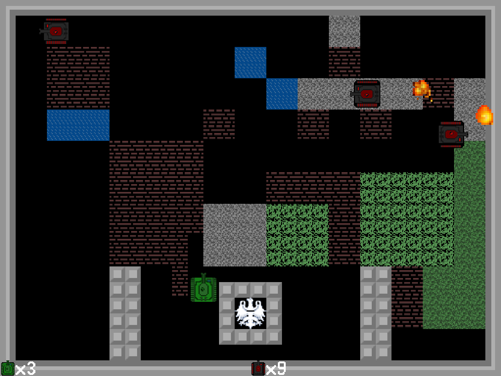

# Programming project #2
This is the project that my friends and I are making to pass the second semester of the programming class at my university. The project is about writing a program using object oriented programming paradigm. We chose to write a game where the player controls a tank and uses it to shoot enemy tanks while protecting the base (denoted by an eagle) from being destroyed.

# Controls

Escape - leaves to the main menu
## Player1
W,S,A,D - Move 
Space - Shoot
## Player2
Arrows - Move 
Enter - Shoot
## Level editor
Use mouse to place tiles 
E - enable/disable tile menu 
S - save 
L - load

# Building
Building is quite easy because this is a simple CMake project that doesn't use any libraries. Just clone the repo, use cmake to create target build directory and then use chosen build system to compile the project.

# Notes
**Note: If you are running Windows (other systems are not supported right now), you should run your build tools with administrator privileges because there is a post-build step that creates a symlink near the executable to the directory that contains assets.**
